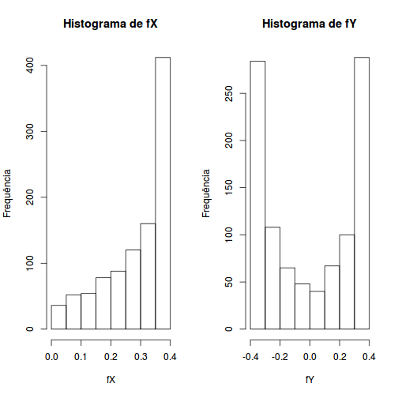
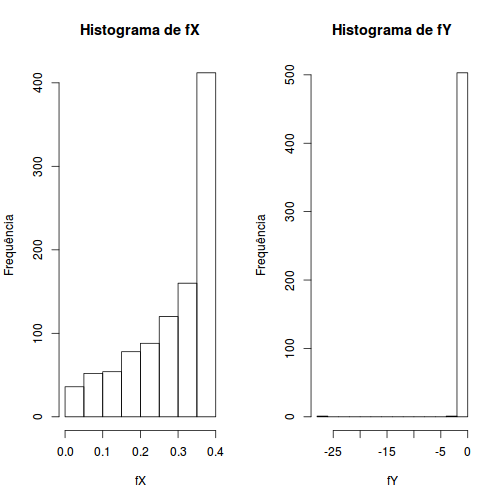
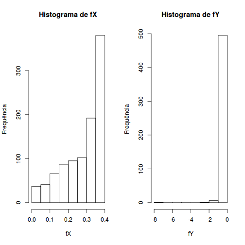
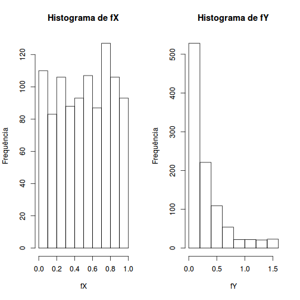
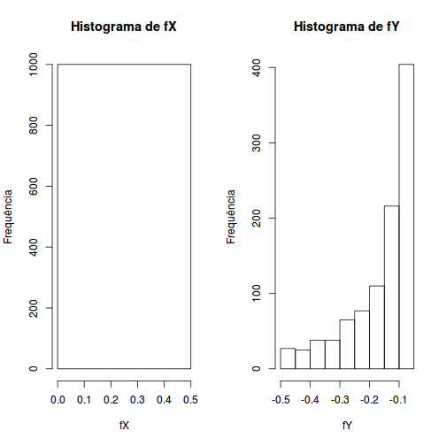

Transformações de Variáveis Aleatórias Contínuas

========================================================
Tranformações de Variáveis Aleatórias Contínuas
-----------------------------------------------

Definições Iniciais 
========================================================

$Y = g(X)$

$X = g^{-1}(Y)$

$F_Y(y)  = \mathbb{P}\{Y \leq y\}$

$\mathbb{P}\{g(X) \leq y\} = \mathbb{P}\{X \leq g^{-1}(Y)\}$

$\mathbb{P}\{X \leq g^{-1}(Y)\} = F_X(g^{-1}(Y))$

$f_Y(y) = F'_Y(y) = \frac{d}{dy}F_X(g^{-1}(y)) = f_X(g^{-1}(y))\frac{d}{dy}g^{-1}(y)$

$f_Y(y) = F'_Y(y) = \frac{d}{dy}F_X(g^{-1}(y))$

Expressões Finais 
========================================================

$f_Y(y) = f_X(g^{-1}(y))\frac{d}{dy}g^{-1}(y)$ 

$f_Y(y) = -f_X(g^{-1}(y))\frac{d}{dy}g^{-1}(y)$

$f_Y(y) = \quad\Biggm\lvert f_X(g^{-1}(y))\frac{d}{dy}g^{-1}(y)\quad\Biggm\lvert$

Resoluções 1
========================================================

$X \sim N(\mu,\sigma^2)$
------------------------

$f_X(x) = \frac{1}{\sigma\sqrt{2\pi}}e^{-\frac{(x-\mu)^2}{2\sigma^2}}$

Resoluções 1.1
========================================================

$Y = \frac{X-\mu}{\sigma}$
--------------------------

$Y = g(X) = \frac{X-\mu}{\sigma}$, para $\sigma \neq 0$

$g^{-1}(Y) = X = Y\sigma+\mu$

$\frac{d}{dy}g^{-1}(y) = \frac{d}{dy}(y\sigma+\mu) = \sigma$

$f_Y(y) = f_X(g^{-1}(y))\frac{d}{dy}g^{-1}(y) = f_X(y\sigma+\mu)\sigma$

$f_Y(y) = \frac{1}{\sigma\sqrt{2\pi}}e^{-\frac{(y\sigma+\mu-\mu)^2}{2\sigma^2}}\sigma = \quad\Biggm\lvert\frac{1}{\sqrt{2\pi}}e^{-\frac{y^2}{2}}\quad\Biggm\lvert$

Resoluções 1.1
========================================================

$Y = \frac{X-\mu}{\sigma}$ (Histogramas)
----------------------------------------

 

Resoluções 1.2
========================================================

$Y = \frac{\sigma}{X-\mu}$
--------------------------

$Y = g(X) = \frac{\sigma}{X-\mu}$, para $X \neq \mu$

$g^{-1}(Y) = X = \frac{\sigma}{Y}+\mu$

$\frac{d}{dy}g^{-1}(y) = \frac{d}{dy}(\frac{\sigma}{y}+\mu) = -\sigma y^{-2}$

$f_Y(y) = f_X(g^{-1}(y))\frac{d}{dy}g^{-1}(y) = f_X(\frac{\sigma}{y}+\mu)(-\sigma y^{-2})$

Resoluções 1.2
========================================================

$Y = \frac{\sigma}{X-\mu}$ (Continuação)
----------------------------------------

$f_Y(y) = \frac{1}{\sigma\sqrt{2\pi}}e^{-\frac{(\frac{\sigma}{y}+\mu-\mu)^2}{2\sigma^2}}(-\sigma y^{-2}) = \frac{1}{\sigma\sqrt{2\pi}}e^{-\frac{1}{2}(\frac{1}{y})^2}(-\sigma y^{-2})$

$f_Y(y) = \quad\Biggm\lvert -\frac{1}{y^2\sqrt{2\pi}}e^{-\frac{1}{2y^2}}\quad\Biggm\lvert$

Resoluções 1.2
========================================================

$Y = \frac{\sigma}{X-\mu}$ (Histogramas)
----------------------------------------

 

Resoluções 1.3
========================================================

$Y = (\frac{X-\mu}{\sigma})^3$
-----------------------------

$Y = g(X) = (\frac{X-\mu}{\sigma})^3$ para $\sigma \neq 0$

$g^{-1}(Y) = X = \sigma Y^{\frac{1}{3}}+\mu$

$\frac{d}{dy}g^{-1}(y) = \frac{d}{dy}(\sigma y^{\frac{1}{3}}+\mu) = \frac{1}{3}\sigma y^{-\frac{2}{3}}$

$f_Y(y) = f_X(g^{-1}(y))\frac{d}{dy}g^{-1}(y) = f_X(\sigma y^{\frac{1}{3}}+\mu)(\frac{1}{3}\sigma y^{-\frac{2}{3}})$

$f_Y(y) = \frac{1}{\sigma\sqrt{2\pi}}e^{-\frac{(\sigma y^{\frac{1}{3}}+\mu-\mu)^2}{2\sigma^2}}(\frac{1}{3}\sigma y^{-\frac{2}{3}}) = \quad\Biggm\lvert y^{-\frac{2}{3}}\frac{1}{3\sqrt{2\pi}}e^{-\frac{1}{2}y^{\frac{2}{3}}}\quad\Biggm\lvert$

Resoluções 1.3
========================================================

$Y = (\frac{X-\mu}{\sigma})^3$ (Histogramas)
--------------------------------------------
 

Resoluções 2
========================================================

$X \sim \varepsilon(1)$, transformar em $Y = X^p$, para $p \neq 0$
------------------------------------------------------------------

$f(x) = \lambda e^{-\lambda x}$
  
$Y = g(X) = X^p$
  
$g^{-1}(Y) = X = Y^\frac{1}{p}$
  
$\frac{d}{dy}g^{-1}(y) = \frac{d}{dy}y^\frac{1}{p} = \frac{1}{p}y^\frac{1-p}{p}$

Resoluções 2
========================================================

$Y = X^p$ (Histogramas)
-----------------------

 

Resoluções 3
========================================================

$X \sim U(0,1)$, transformar em $Y = aX+b$
------------------------------------------

$f(x) = \frac{1}{b-a}I_{[a,b]}(x)$\\
  
$Y = g(X) = aX+b$\\
  
$g^{-1}(Y) = X = \frac{a}{Y}-b$\\
  
$\frac{d}{dy}g^{-1}(y) = \frac{d}{dy}(\frac{a}{y}-b) = -ay^{-2}$\\
  
$f_Y(y) = f_X(g^{-1}(y))\frac{d}{dy}g^{-1}(y) = f_X(\frac{a}{y}-b)(-ay^{-2})$\\
  
$f_Y(y) = \frac{1}{b-a}(-ay^{-2}) = -\frac{a}{y^2(b-a)}$
  
Resoluções 3
========================================================

$Y = aX+b$(Histogramas)
-----------------------

 
